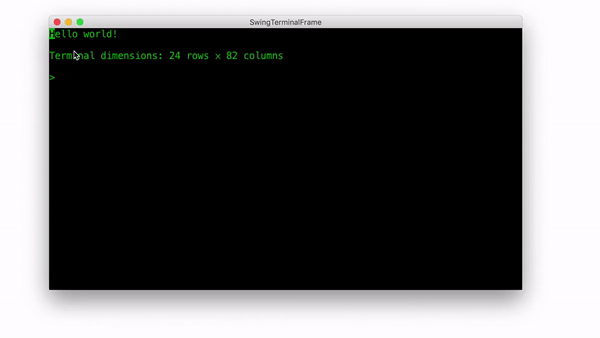
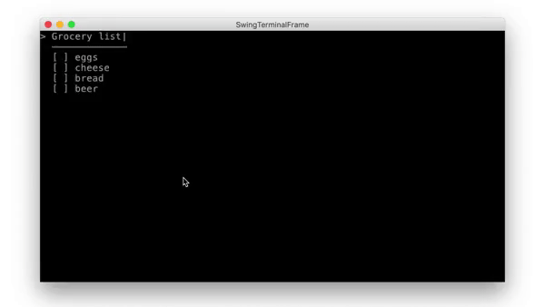

# hello-terminal

## terminal-workflow

Small, simple sample library for writing terminal applications with workflows.

The API entry points are `TerminalWorkflow` and `TerminalWorkflowRunner`. Create one of each of
those, and pass your workflow to `TerminalWorkflowRunner.run()`.

Your `TerminalWorkflow` will get the current size of the terminal as `PropsT`, render a
`TerminalRendering` that includes the text to display, foreground and background colors, and an
event handler to receive keystroke events. It can also exit the process by emitting an integer
exit code.

This module delegates to the third-party library [Lanterna](https://github.com/mabe02/lanterna)
to do the actual hard work of talking to the system terminal.

## hello-terminal-app

Sample app demonstrating one possible way of writing terminal applications with workflows.
Makes use of the terminal workflow infrastructure in `:samples:hello-workflow:terminal-workflow`.

Run with `./gradlew :samples:hello-terminal:hello-terminal-app:run`

## todo-terminal-app

Sample app that uses the sample `terminal-workflow` library to build a really simple TODO app that
can only track one todo list.

It has a root workflow that stores the title and list of items and their checked flags in its state.
It is responsible for rendering the list. It also keeps track of which item or the title is
currently selected/focused, and listens to keyboard events to update that pointer. When an item
is selected, pressing the Enter key will toggle its checked state. The currently-selected item or
title can also be edited by just typing.

When rendering the focused field, the root workflow delegates to an `EditTextWorkflow`. This
workflow takes the text to render as input, and returns that text with a "cursor" rendered on it.
It also maintains internal state of where the cursor is in the text, and listens for key events
that either add text, remove text (backspace), or move the cursor (left/right arrow keys). The
parent workflow just declaratively renders the edit text workflow and is oblivious to how it's doing
text entry.

Run with `./gradlew :samples:hello-terminal:todo-terminal-app:run`

